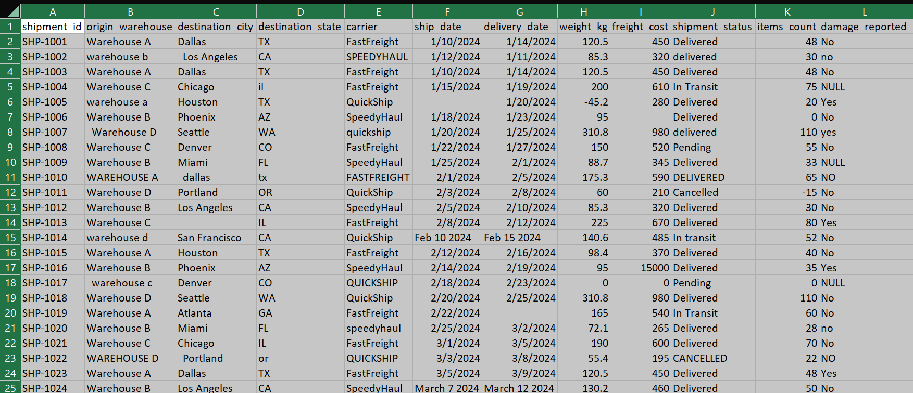
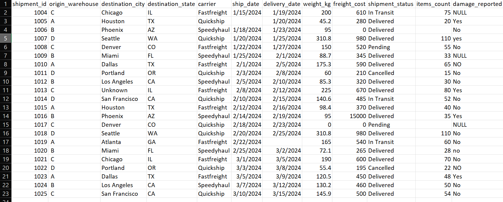

# Data-cleaning-Project-using-SQL

Cleaning a logistics company exports shipment's records  using SQL for analytics 

## Table of Contents

- [Overview](#overview)
- [Objectives](#objectives)
- [Dataset Information](#dataset-information)
- [Project Structure](#project-structure)
- [Tools & Technologies](#tools--technologies)
- [Data Cleaning Tasks Performed](#data-cleaning-tasks-performed)
- [SQL Techniques Used](#sql-techniques-used)
- [Setup Instructions](#setup-instructions)
- [Workflow](#workflow)
- [Key Findings](#key-findings)
- [Before vs After Cleaning](#Before-vs-after-cleaning)
- [Challenges Encountered](#challenges-encountered)
- [Author](#author)
- [License](#license)

  # Overview

This project focuses on cleaning raw shipment records using SQL to improve data quality, consistency, and reliability to help in business intelligence reporting,conducting freight cost analysis & carrier perfomance reporting.

# Objectives.

- Remove duplicate records
- Validation of dates
- Handle missing/null values
- Standardize inconsistent formats
- Correct invalid data entries
- Improve overall data integrity
- Prepare data for analysis and visualization

# Dataset Information

Describe the dataset.

| Feature | Description |
|---|---|
| Source | simulated shipment records / CSV |
| Rows | 25 |
| Columns | 12 |
| Format | CSV |
| Domain | Logistics |

The dataset contains shipment records collected from a warehouse management system database  between Jan/01/2025 and Mar/10/2025.

# Project Structure

```bash
project-folder/
│
├── data/
│   ├── shipments.csv
│   └── cleaned_shipments.csv
│
├── sql/
│   ├── 01_create_tables.sql
│   ├── 02_data_cleaning.sql
│   └── 03_validation_queries.sql
│
├── screenshots/
│
├── README.md
└── results/
```

# Tools & Technologies
- SQL
- PostgreSQL
- Excel / CSV files
- Git & GitHub

# Data Cleaning Tasks Performed

This section outlines the key data cleaning operations carried out to improve data quality, consistency, and usability for analysis.

## 1. Removing Duplicates

Duplicate records were identified and removed to ensure data accuracy and eliminate redundancy.
```python
/*CLEANING DUPLICATES*/
--Deletes duplicate rows
WITH duplicate AS (
	SELECT 
	*,
		ROW_NUMBER() OVER (PARTITION BY destination_state,origin_warehouse,destination_city,weight_kg,freight_cost ORDER BY ship_date DESC)
	AS rn
FROM shipments)
DELETE FROM shipments 
WHERE shipment_id IN (
SELECT shipment_id
FROM duplicate 
WHERE rn > 1);
```

### Tasks Performed:
- Used `ROW_NUMBER()` window function to detect duplicate entries
- Removed redundant rows while preserving unique records
- Verified dataset integrity after deletion

## 3. Standardizing Data Formats

Data formatting inconsistencies were corrected to maintain uniformity across the dataset.

### Tasks Performed:
- Standardized date formats into a consistent structure
- Unified text capitalization for categorical fields using UPPER & INITCAP functions
- Trimmed unnecessary spaces and formatting inconsistencies
- Replaced NULL values where appropriate using COALESCE function

## 4. Correcting Inconsistent Values

Inconsistent and incorrect values were cleaned to improve data consistency.

### Tasks Performed:
- Corrected spelling and naming inconsistencies
- Standardized categorical labels and entries using  ABS,REGEXP_REPLACE & NULLIF functions.

## 5. Data Type Conversion

Columns were converted into appropriate data types to ensure accurate processing and analysis.

```sql
/*CLEANING*/
CREATE TABLE cleaned_shipments AS
SELECT 
    REGEXP_REPLACE(shipment_id, 'SHP-', '') AS shipment_id,
    
    REGEXP_REPLACE(INITCAP(TRIM(origin_warehouse)),'Warehouse','')   AS origin_warehouse,
    
    INITCAP(COALESCE(NULLIF(TRIM(destination_city),''),'Unknown')) AS destination_city,
        
    UPPER(TRIM(destination_state)) AS destination_state,
    
    INITCAP(TRIM(carrier))AS carrier,
    
   CASE 
   		WHEN ship_date ~ '^\d{1,2}/\d{1,2}/\d{4}$' 
   			THEN TO_DATE(ship_date,'MM/DD/YYYY')
   		--FEB 10 2024
   		WHEN ship_date ~ '^[A-Za-z]{3} \d{1,2} \d{4}$'
   			THEN TO_DATE(ship_date,'Mon DD YYYY')
   		--March 12 2024
   		WHEN ship_date ~ '^[A-Za-z]{5} \d{1,2} \d{4}$'
   				THEN TO_DATE(ship_date,'Month DD YYYY')
   		ELSE NULL
   		END AS ship_date,
   
    CASE 
    -- Format: M/D/YYYY or MM/DD/YYYY
    WHEN delivery_date ~ '^\d{1,2}/\d{1,2}/\d{4}$'
      THEN TO_DATE(delivery_date, 'MM/DD/YYYY')

    -- Format: Feb 15 2024 (short month)
    WHEN delivery_date ~ '^[A-Za-z]{3} \d{1,2} \d{4}$'
      THEN TO_DATE(delivery_date, 'Mon DD YYYY')

    -- Format: March 12 2024 (full month)
    WHEN delivery_date ~ '^[A-Za-z]+ \d{1,2} \d{4}$'
      THEN TO_DATE(delivery_date, 'Month DD YYYY')
    ELSE NULL
  END AS delivery_date,
    
    ABS(weight_kg) AS weight_kg,
    
    COALESCE(freight_cost,0) AS freight_cost,
    
    INITCAP(shipment_status) AS shipment_status,
    
    CASE  
	    WHEN items_count = '0' THEN NULL
	    ELSE ABS(items_count) 
	END AS items_count,
    
    damage_reported
FROM shipments;

```

### Tasks Performed:
- Converted text fields into date data types where necessary using regular expression pattern match operator.

# SQL Techniques Used

Mention important SQL concepts used in the project.
-	CTEs
-	WINDOW FUNCTIONS
-	CASE WHEN
-	JOINS
-	SUBQUERIES
-	TRIM()
-	REPLACE()
-	CAST()
-	COALESCE()

# Setup Instructions

## Prerequisites

Before running this project, ensure you have the following installed:

- MySQL or PostgreSQL (depending on your project setup)
- A SQL client or database tool such as:
  - pgAdmin (for PostgreSQL)
  - MySQL Workbench (for MySQL)
  - DBeaver (optional but recommended)
  - BIGQUERY (recommended)
- Basic understanding of SQL execution in a database environment
- The dataset file (CSV)
---

## Steps to Run the Project

### 1. Clone the Repository

Download the project from GitHub using the command below:

```bash
git clonehttps://github.com/Swahil/Data-cleaning-Project-using-SQL.git
```

### 2. Open the Project Directory

Navigate into the cloned folder:

```bash
cd project-name
```
### 3. Open Your SQL Environment

Launch your preferred SQL tool (e.g., pgAdmin or MySQL Workbench) and connect to your database instance.

### 4. Import the Dataset

Load the raw dataset into your database using one of the following methods:

- Import via CSV upload tool in your SQL client

 ### 5. Run SQL Scripts in Order

Execute the SQL scripts sequentially to recreate tables, clean data, and validate results:

  01_create_tables.sql
  
  02_data_cleaning.sql
  
  03_validation_queries.sql

Make sure each script runs successfully before moving to the next.
---

# Workflow

This section outlines the step-by-step process followed in this SQL data cleaning project.

---

## Steps

### 1. Import Raw Dataset
The raw dataset is loaded into the database from CSV . This serves as the starting point for all cleaning operations.

### 2. Explore Data Quality Issues
Initial data exploration is performed to identify issues such as:
- Duplicate records
- Inconsistent formats
- Invalid or outlier entries

### 3. Perform Data Cleaning Operations
SQL queries are used to clean and standardize the dataset, including:
- Removing duplicates
- Standardizing formats (dates, text, etc.)
- Correcting inconsistent entries
- Converting data types

### 4. Validate Cleaned Data
After cleaning, validation checks are performed to ensure:
- Data integrity is maintained
- No invalid records remain
- Cleaning rules were applied correctly
- Create a new table 

### 5. Export Cleaned Dataset
The final cleaned dataset is exported for use in analysis, reporting, or visualization tools such as Excel, Power BI, or Python.
---

# Key Findings

## Summary of Results

- Inconsistent category labels were standardized for uniformity
- Data formatting issues (dates, text casing, spacing) were fully resolved
- Dataset quality was significantly improved, making it ready for analysis and reporting
---
# Before-vs-after-cleaning





# Challenges Encountered

During the data cleaning process, several technical and data-related challenges were identified and addressed.

---

## Key Challenges

- Inconsistent date formats across multiple records, requiring standardization before processing
- Mixed categorical naming conventions (e.g., different spellings or variations for the same category)
- Presence of invalid or unexpected values that affected data type conversions


---

## Outcome

These challenges were resolved using SQL techniques such as data type conversion, string standardization and validation queries, resulting in a clean and reliable dataset.
The raw data was riddled with entry errors, inconsistencies, and missing values accumulated over years of manual data entry across multiple warehouses. The dataset was cleaned and standardized  so it can reliably power operational dashboards, freight cost analysis, and carrier performance reporting.
---

# Author
 
**Benjamin Njoroge Githua**  
- GitHub: https://github.com/Swahil  
- Email: benjaminnjoroge7@gmail.com  

---

# License

This project is licensed under the MIT License. You are free to use, modify, and distribute this project with attribution.


---
